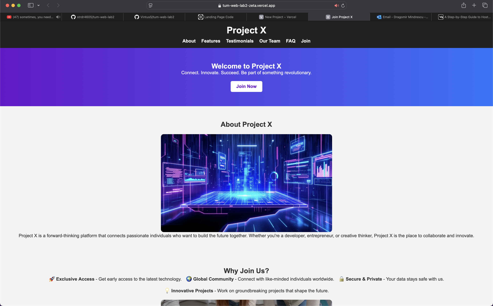
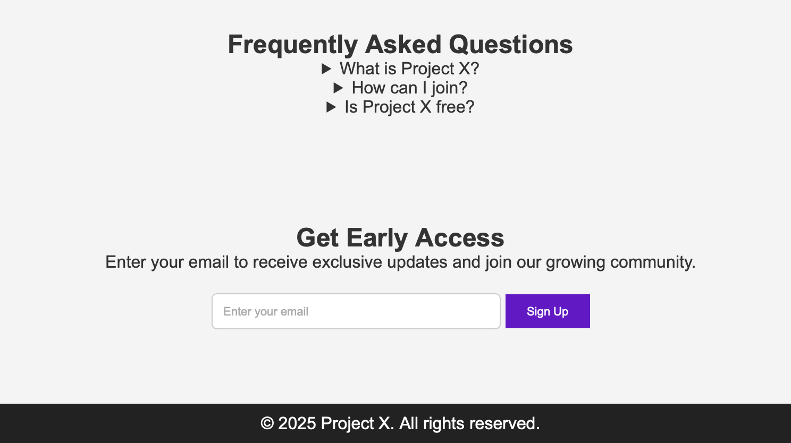

# 🚀 Project X - Landing Page

Welcome to the **Project X Landing Page**, designed to invite and onboard referred friends to join our initiative. This modern and responsive webpage provides an engaging user experience with smooth navigation, a call to action, and an email subscription form.

## 🌟 Features
✅ Smooth scrolling navigation  
✅ Animated image appearance effect  
✅ Clean and responsive design  
✅ Email input field for referrals  
✅ Deployed for easy access  

## 📸 Screenshots
  
  

## 🔗 Live Demo
🔗 **[View the live website here](https://tum-web-lab2-zeta.vercel.app)**  

*(Replace this link with your actual deployed URL, e.g., GitHub Pages, Vercel, or Netlify.)*

## 🚀 Getting Started

### 1️⃣ Clone the Repository
```sh
git clone https://github.com/VintusS/tum-web-lab2
