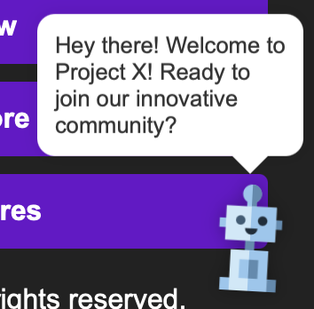

# 🚀 Project X - Landing Page

Welcome to the **Project X Landing Page**, designed to invite and onboard referred friends to join our initiative. This modern and responsive webpage provides an engaging user experience with smooth navigation, a call to action, and an email subscription form.

## 🌟 Features
✅ Smooth scrolling navigation  
✅ Animated image appearance effect  
✅ Clean and responsive design  
✅ Email input field for referrals  
✅ Deployed for easy access  
✅ Fully responsive layout for mobile and desktop  
✅ Interactive robot mascot with animations  
✅ Mobile-specific quick access section  
✅ **NEW: Tailwind CSS integration for modern styling**

## 🆕 Latest Updates
### Tailwind CSS Integration (Lab 4)
- Added Tailwind CSS framework via CDN
- Redesigned hero section with Tailwind's gradient and typography classes
- Rebuilt features section with responsive grid layout and card components
- Enhanced visual appeal with shadows, hover effects, and color schemes
- Improved responsiveness using Tailwind's built-in breakpoint system

### Responsive Design
- Optimized layout for various screen sizes
- Enhanced mobile navigation
- Improved readability on small screens
- Added mobile-specific quick access buttons

### Interactive Mascot
- Added friendly robot mascot
- Implemented bounce and hover animations
- Displays welcome message on hover
- Positioned strategically for desktop and mobile views

## 📸 Screenshots
  
  
  
  

## 🔗 Live Demo
🔗 **[View the live website here](https://tum-web-lab2-zeta.vercel.app)**  

🔗 **[View the demo recording for second laboratory here](https://drive.google.com/file/d/1W696nA1tE2Nle_t5fjxuB2oDh9JTC8CK/view?usp=sharing)**

🔗 **[View the demo recording for third laboratory here](https://drive.google.com/file/d/1qQoPWclOZIm_qRWckhCLVSGzEtKFLXa9/view?usp=sharing)**

🔗 **[View the demo recording for fourth laboratory (Tailwind CSS) here](YOUR_NEW_LINK_HERE)**

## 🚀 Getting Started

### 1️⃣ Clone the Repository
```sh
git clone https://github.com/VintusS/tum-web-lab2